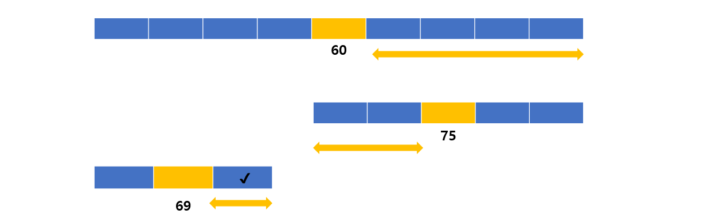

## 탐색 알고리즘 


* #### 이진탐색 Binary Search

  * **만약 수많은 병들중 70번째의 숫자가 적힌 병뚜껑을 찾게 된다면?** 
    * 

* **정렬이 되어있다는 조건하에서 1/2씩 나우어 중간을 체크하고 어느쪽에 있는지 판단해야 한다.** 
* **이진탐색 vs 순차탐색 => 이진탐색 속도가 훨씬 빠르다.** 


* **분할 정복 알고리즘과 이진탐색 (Devide and Conquer)**
  * 주로 재귀용법을 가지고 구현한다. 
  * Devide : 문제를 하나 또는 둘 이상으로 나눈다. 
  * Conquer : 나눠진 문제가 충분히 작고, 해결이 가능하다면 해결하고 그렇지 않다면 다시 나눈다. 
* **이진 탐색 Devide , Conquer**
  * 리스트를 2개의 스브 리스트로 나눈다. 
  * 검색할 숫자(search)  >  중간값이면, 뒷부분의 서브리스트에서 검색할 숫자 찾기 
  * 검색할 숫자(search)  <  중간값 이면, 앞부분의 서브 리스트에서 검색할 숫자를 찾기 

---


**코드 구현 방법**

- `이진 탐색은 데이터가 정렬되어 있는 상태에서 진행한다. `

- `데이터가 [2, 3, 8, 12, 20] 일때 binary_search(data_list, find_data) 함수를 만들고`

  * `data_list : 데이터 리스트`

  * `find_data : 찾는 숫자`

- `data_list 의 중간값을 find_data와 비교해서 find_data < data_list 중간값이라면 맨 앞부터 data_list 의 중간까지에서 다시 find_data 찾기`
- `data_list의 중간값 < find_data 이라면 data_list의 중간부터 맨끝까지에서 다시 find_data 찾기 그렇지 않다면 data_list의 중간값은  find_data 인 경우로, return data_list 중간위치`


---


**알고리즘 구현**

```python
def binary_search(data, search):
    print (data)
    if len(data) == 1 and search == data[0]:
        return True
    if len(data) == 1 and search != data[0]:
        return False
    if len(data) == 0:
        return False
    
    medium = len(data) // 2
    if search == data[medium]:
        return True
    else:
        if search > data[medium]:
            return binary_search(data[medium+1:], search)
        else:
            return binary_search(data[:medium], search)
```


---


* #### 순차탐색 Sequential Search 

  * 여러 데이터 중에서 원하는 데이터를 찾아내는 것을 의미 
  * 데이터가 담겨있는 리스트를 앞에서 부터 하나씩 비교해서 우너하는 데이터를 찾는 방법 